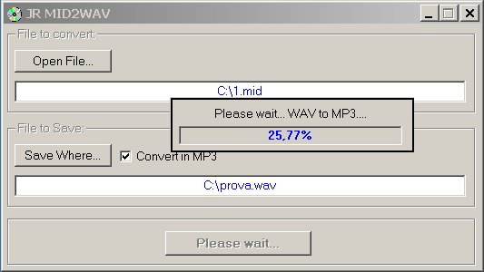



## Jr MID2WAV

### Description

Great working Mid to wave (and Mp3!!). Very useful to me because is fast and it works! ;)
 
### More Info
 

             |
---                |---
**Submitted On**   |2003-01-27 18:00:12
**By**             |[James Raynor2](https://github.com/Planet-Source-Code/PSCIndex/blob/master/ByAuthor/james-raynor2.md)
**Level**          |Intermediate
**User Rating**    |4.4 (31 globes from 7 users)
**Compatibility**  |VB 5\.0, VB 6\.0
**Category**       |[Complete Applications](https://github.com/Planet-Source-Code/PSCIndex/blob/master/ByCategory/complete-applications__1-27.md)
**World**          |[Visual Basic](https://github.com/Planet-Source-Code/PSCIndex/blob/master/ByWorld/visual-basic.md)
**Archive File**   |[Jr\_MID2WAV1535701282003\.zip](https://github.com/Planet-Source-Code/james-raynor2-jr-mid2wav__1-42764/archive/master.zip)

